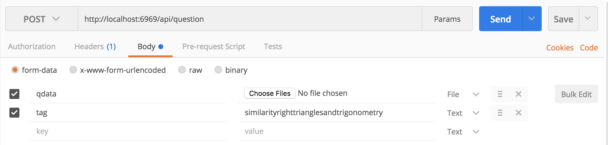

# SAT Bank
This is the skeleton for a bank of SAT questions that can be searched through based on their topics (and eventually other attributes). It also generates a PDF with the questions you select.

## How to run it
In order to run the app, go through this steps once:
  1. Install NodeJS at nodejs.org
  2. Install MongoDB
     * [On Windows](https://docs.mongodb.com/manual/tutorial/install-mongodb-on-windows/)
     * [On Mac](http://treehouse.github.io/installation-guides/mac/mongo-mac.html)
  3. Install a Latex compiler like TexLive or MacTex (for Mac) that allows you to compile a latex document using `pdflatex your.tex` in the command line.
  4. In the "app" directory, type `npm install` into the command line. This should install the necessary dependencies.
  5. If it isn't on already, turn javascript on in the browser. This has likely already been done.
  6. You will need to add questions to the questions database for the app to be useful. See below for further instructions.

Go through these steps every time you run the app:
  1. Start MongoDB (view instructions for running MongoDB above. This is not as difficult as intallation, don't worry).
  2. In the "app" directory, type `node app` into the command line.
  3. Go to localhost:6969 in the browser
  4. Use!

## How to add files to the questions database
For this, we recommend using Postman to send POST requests to the API. You can also use it to send GET requests. Follow these steps to add questions using postman:
  1. Install [Postman](https://www.getpostman.com/)
  2. Open Postman.
  3. Run the app.
  4. Change the type of request to POST and use this http://localhost:6969/api/question as the request url.
  5. Click on the body tab underneath the url field.
  6. For the first key type in `qdata` and for the second type in `tag`.
  7. Change the type for the value of `qdata` to a file and upload the file in image format.
  8. Type in a value for the tag corresponding to one of the tags in tags.json (the ones displayed in the checkboxes on the site). However, modify it slightly by 1. eliminating all spaces, 2. eliminating all punctuation, and 3. making it all lowercase.
  
  9. That question has been added and can now by searching with the correct tag.
